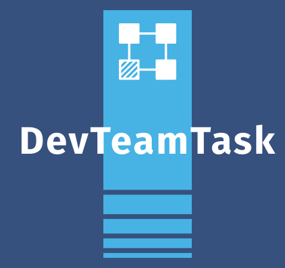
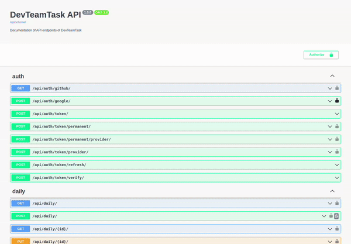

<h1 align="center">
  <br>
  <a href="http://35.198.36.42/"></a>
  <br>
  DevTeamTask
  <br>
</h1>

<h4 align="center">A task management software for development team built on top of <a href="https://fastapi.tiangolo.com/" target="_blank">FastAPI</a>.</h4>


<p align="center">
  <a href="https://github.com/cookiecutter/cookiecutter-django/">
    
  </a>
  <a href="https://github.com/ambv/black"></a>

</p>

<p align="center">
  <a href="#key-features">Key Features</a> •
  <a href="#how-to-use">How To Use</a> •
  <a href="#credits">Credits</a> •
  <a href="#license">License</a> •
  <a href="#contact">Contact</a>
</p>



## Key Features

* User control
  - With support for sending an email if the user wants to reset the password outside the application
* Socal authentication
  - Supports: Google and Github
* Project management  
* Project status management
* Project tag management
* Project sprint management
* Project task management
* Event note management
* App routes secured with `JWT` authorization
* Encryption for sensitive information

## How To Use

To clone and run this application, you'll need [Git](https://git-scm.com), [Python 3.10.6](https://www.python.org/download/) and [Postgres 15.3](https://www.postgresql.org/download/). From your command line:

```bash
# Clone this repository
$ git clone https://github.com/Talismar/devteamtask-v2-back devteamtask-back

# Go into the repository
$ cd devteamtask-back

# Create enviroment virtual
$ python3 -m venv venv

# Active enviroment virtual
$ source venv/bin/activate

# Install dependencies
$ pip install -r requirements/production.txt

# export global variable
$ export DJANGO_READ_DOT_ENV_FILE=True

# run the project
$ python manage.py makemigrations
$ python manage.py migrate
$ python manage.py load_db_v1
$ python manage.py runserver
```

> **Note**
> If you're using Linux Bash for Windows, [see this guide]().

## Credits

This software uses the following open source packages:

- [FastAPI](https://fastapi.tiangolo.com/)
<!-- - 
    TODO: Completed the list of packages
 -->


## You may also like...

- [DevTeamTask-CLI](https://github.com/Talismar/devteamtask-cli) - A task management software for development team
- [DevTeamTask-Frontend](https://gitlab.com/Talismar/devteamtask-front) - A task management software for development team
- [DevTeamTask-Figma](https://www.figma.com/file/93HpbAt9qbG8F41DQERB37/DevTeamTask-%7C-PI-02?type=design&mode=design&t=DoRfhoPhuCJtCq7Q-1) - A task management software for development team

## License

MIT

---

## Contact 

> GitHub [Talismar](https://github.com/Talismar) Facebook [Tali Fer Costa](https://www.facebook.com/tali.fercosta) Gmail [talismar788.una@gmail.com]()
